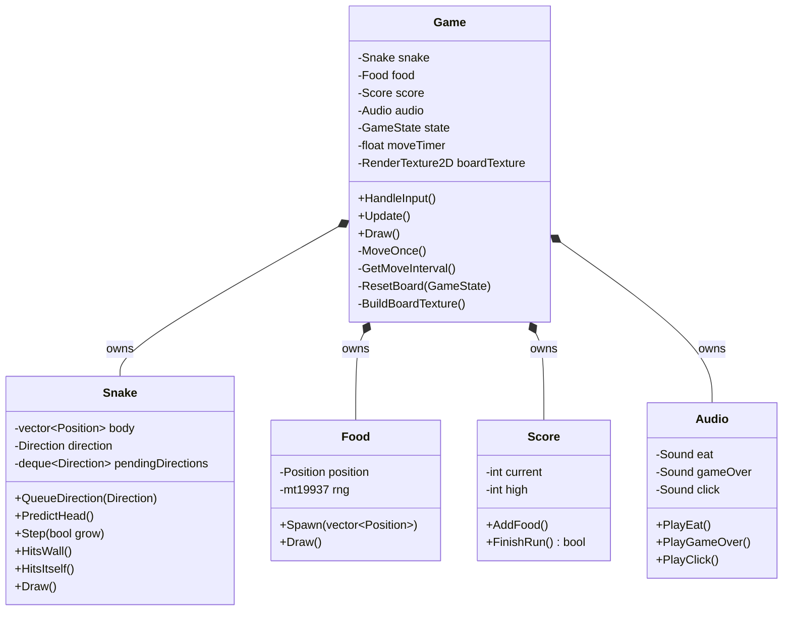
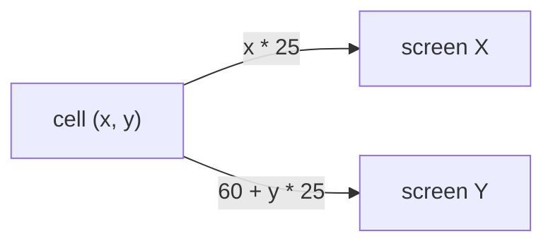
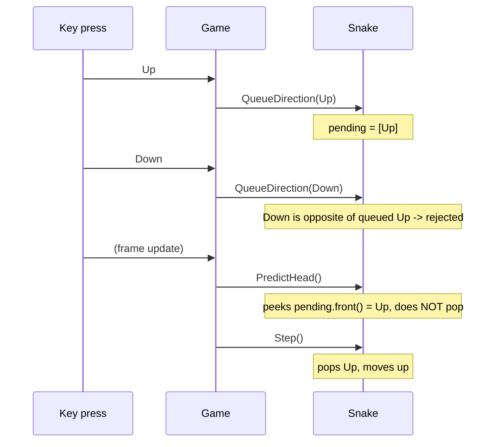
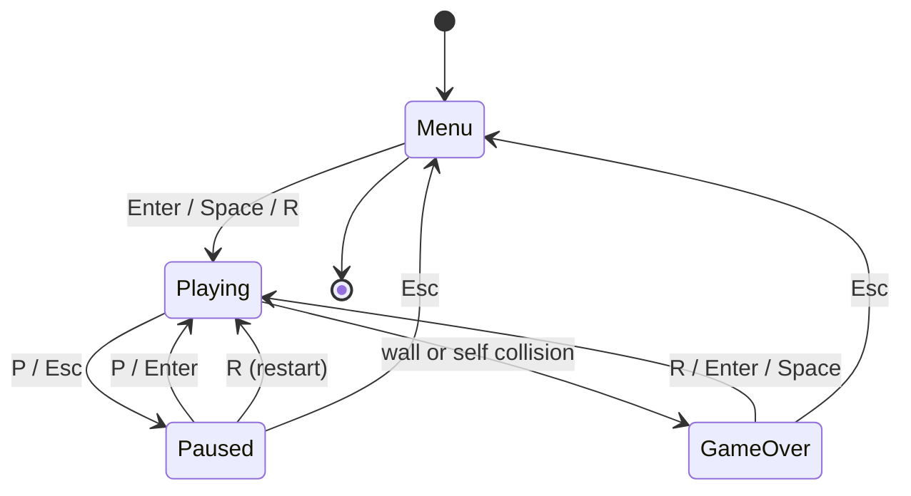
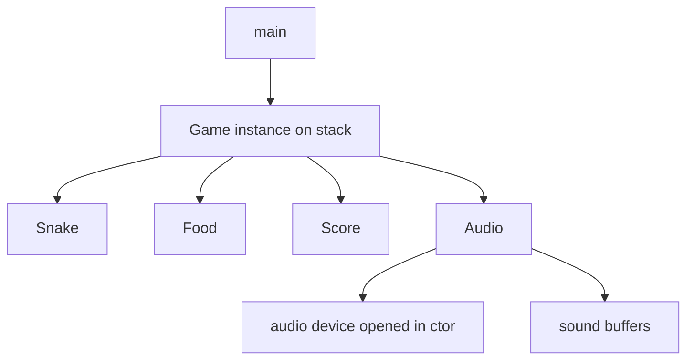
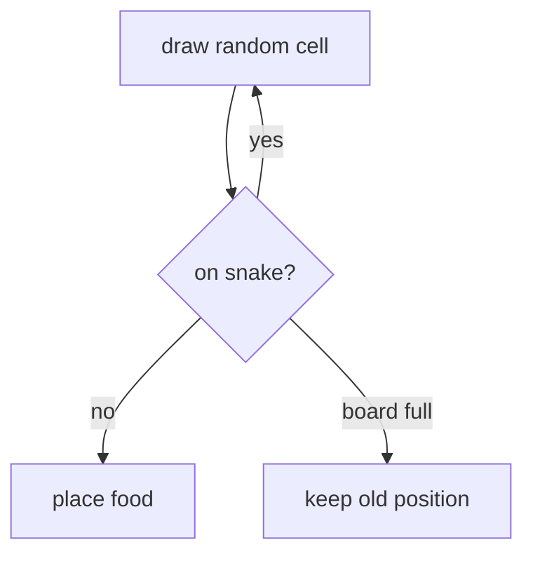

# Teaching guide: how this Snake game works

This document is a guided tour of the codebase. It is written to be read *before*
looking at any single file in detail, and to be useful whether you are learning
from it, teaching it, or defending it in a viva.

## Companion guides

- [BUILD.md](BUILD.md) — toolchain, `Makefile`, troubleshooting
- [GLOSSARY.md](GLOSSARY.md) — C++ terms used here

---

## 0. Run it first

```bash
make run          # build and start
make test         # run the logic tests (no window needed)
make help         # list targets
```

In game, press **F1** to toggle the teaching overlay. It shows the head and tail
cells, the queued turns, the move timer against its interval, and the current
state — everything below becomes *observable* instead of theoretical.

---

## 1. The mental model in 60 seconds

Everything in this game is a **cell** on a 30 x 20 grid. Cells are converted to
pixels only when drawing (`pixel = cell * 25`). The program has three phases per
frame, repeated until the window is closed:

```text
            +------------------+
            |   main() loop    |
            +--------+---------+
                     |
        +------------+------------+
        v                         |
  HandleInput()                   |
        |                         |
        v                         |
     Update()   <- only while Playing
        |                         |
        v                         |
      Draw()  ---------------------+
```

```text
main loop (about 60 times per second)
  1. HandleInput()   read keys, maybe change state
  2. Update()        advance the simulation (0 or more snake moves)
  3. Draw()          paint everything
```

Two ideas carry the whole program:

1. **A state machine decides what the keys mean.** In the menu, Enter starts a
   game. While playing, Enter does nothing; arrows steer. Paused, arrows do
   nothing.
2. **Drawing and moving are separate.** The screen refreshes at 60 FPS, but the
   snake moves only when its timer expires — and that interval shrinks as you
   score.

---

## 2. Reading order

Read in this order; each file only depends on the ones above it.

| # | File | What to notice | C++ topic |
| - | ---- | -------------- | --------- |
| 1 | `include/Types.h` | Everything is a cell, not a pixel; constants instead of magic numbers | `struct`, `enum class`, `namespace`, `inline constexpr`, free functions, `switch` |
| 2 | `src/main.cpp` | The whole program is a loop plus a scoped object | entry point, scoping, RAII teardown order |
| 3 | `include/Snake.h` + `src/Snake.cpp` | Body as a container, turns as a queue, `const` on every query | `std::vector`, `std::deque`, `const` methods, encapsulation |
| 4 | `include/Food.h` + `src/Food.cpp` | Random spawn that retries until legal | `std::mt19937`, `std::uniform_int_distribution`, rejection sampling |
| 5 | `include/Score.h` + `src/Score.cpp` | Persistent state with graceful failure | file streams, `std::string`, error handling |
| 6 | `include/Audio.h` + `src/Audio.cpp` | Sounds built by arithmetic, cleaned up by a destructor | RAII, copy deletion, `static` members |
| 7 | `include/Game.h` + `src/Game.cpp` | The state machine, timing, and collision order | composition, private helpers, dispatch |
| 8 | `src/GameInput.cpp` | One keyboard branch per state, so bindings cannot collide | `switch` on an `enum class`, input handling |
| 9 | `src/GameRender.cpp` | Theme palette, baked board texture, HUD, and every overlay | anonymous namespace, internal linkage, file-local helpers |
| 10 | `tests/logic_test.cpp` | The rules proven without a window | `assert`, testable design |

**Suggested pacing:** files 1-2 in one session (30 min), 3-6 in one session
(60 min), 7-10 in one session (60 min). Use the F1 overlay as you go.

`Game` is one class whose implementation is spread over three `.cpp` files:
`Game.cpp` decides what happens, `GameInput.cpp` reads the keyboard, and
`GameRender.cpp` draws. The header lists every method once, so the three files
are three *views* of the same class rather than three classes.

---

## 3. Class structure



ASCII equivalent:

```text
Game  (state machine, timing, rendering)
 ├── owns Snake   body vector + queued turns + drawing
 ├── owns Food    one position + random generator
 ├── owns Score   current score + high score (file)
 └── owns Audio   three synthesized sounds + the audio device
```

**Why composition instead of inheritance?** There is no `Entity` base class with
`virtual Draw()`. With four concrete types and one owner, a base class would add
a vtable and indirection to save nothing. Inheritance earns its keep when you
have *many interchangeable implementations behind one interface*. The place where
this code does need a "many implementations" mechanism is the **state machine**,
and an `enum` + `switch` beats four `GameState` subclasses because the
transitions are all visible in one function.

---

## 4. The core algorithms

### 4.1 The board: cells, not pixels

`Config::CellSize` is 25, the grid is 30 x 20, the HUD strip is 60 px tall.



```text
 screen (0,0)
 +------+------------------ 750 px ------------------+
 | HUD  |  60 px tall: score, high score, length     |
 +------+---------------------------+---------------+
 |  (0,0)| (1,0) | (2,0) | ...      | play area     |  20 rows
 +-------+-------+-------+----------+---------------+
 |  (0,1)| (1,1) | ...              |  30 columns   |
 +-------+-------+--------------+---+---------------+
```

Consequence: every collision test is plain integer equality. No floating point
is involved until drawing — and that conversion happens only *once*: at startup
`Game::BuildBoardTexture()` paints the whole checkerboard into a
`RenderTexture2D`, and `DrawGrid()` blits that texture every frame instead of
issuing 600 `DrawRectangle()` calls.

### 4.2 The frame loop and the fixed timestep

```text
Update()                                   (Game.cpp)
  if state != Playing -> return
  moveTimer += GetFrameTime()              accumulate real elapsed time
  interval  = GetMoveInterval()            how long one move should take

  while (moveTimer >= interval)            drain the debt
      moveTimer -= interval
      MoveOnce()                           one logical snake step
      if state changed -> break            a fatal step must not keep stepping
```

```text
frame 1 (16 ms)     frame 2 (16 ms)     frame 3 (48 ms, hitch)
moveTimer 0.016     0.032               0.080
interval 0.150      0.150               0.150
-> no move          -> no move          -> move (0.15), move (0.15), leftover 0.05
```

**Why not "move once per frame"?** Then speed would depend on FPS. A 144 Hz
monitor would make the game 2.4x harder. **Why not just `if (moveTimer >= interval)`?**
Then a frame hitch silently slows the snake. The `while` loop catches up, so the
snake's *speed* is tied to score, never to the renderer.

This is the standard "accumulator" pattern; the mirror image of it is where
raylib's `SetTargetFPS(60)` sits: rendering is capped, simulation is not.

### 4.3 Turning: buffer, then peek/pop

A naive implementation sets `direction` immediately on key press. That breaks in
two ways: pressing Up then Down within one frame would reverse the snake into
itself, and fast players lose turns that arrive between moves.



```text
QueueDirection(new):
    last = pending.back() if any, else current direction
    if new is opposite of last  -> ignore      (would be a 180)
    if new == last              -> ignore      (already going there)
    if pending.size() == 2      -> ignore      (buffer full)
    pending.push_back(new)

PredictHead():   uses pending.front()   -- PEEK, nothing is removed
Step():          uses pending.front()   -- POP,  then inserts the new head
```

The **peek** and the **pop** must agree, otherwise the cell predicted for the
wall test is not the cell the snake actually occupies. That contract is the
single most bug-prone thing in the project — press F1 and watch
`QUEUED TURNS [Up]` appear and disappear one step later.

**Why cap at 2?** Two turns is enough for any human (a turn plus a correction).
A larger queue would let the player pre-program moves several steps ahead, and
would make prediction and wall-testing much harder to reason about.

### 4.4 Collision order (the subtle one)

```text
MoveOnce()
  1. nextHead = PredictHead()          peek, no mutation
  2. IsWithinGrid(nextHead)?           death decided BEFORE anything changes
        no  -> GameOver, return
  3. ate = (nextHead == food)
  4. Step(ate)                         pops turn, inserts head, drops tail unless ate
  5. if ate: score++, sound, respawn food
  6. HitsItself()?                     tail is already gone -> its old cell is legal
        yes -> GameOver
```

```text
Before Step()               After Step(grow = false)

  X X X H ->                    X X X H
          F                          F
  tail still occupies its cell       tail removed, cell now free
  (a "collision" here would be wrong)
```

Because step 4 removes the tail *before* step 6 runs, a snake can legally drive
into the cell its tail just vacated. Getting this order wrong is the classic
"snake dies for no reason" bug — and it is why the self-check comes last.

Note also that `Snake::HitsWall()` tests the *current* head, while `Game` tests
the *predicted* head via `IsWithinGrid()`. `Types.h::IsWithinGrid()` is the one
place the grid bounds are defined.

### 4.5 The state machine



```text
          +------+   Enter/Space/R    +---------+
          | Menu | -----------------> | Playing |
          +------+                    +---------+
             ^                        |   |   |
             | Esc                    |   |   | P / Esc
             |                        |   |   v
             |                        |   | +-------+
             +------- Esc ----------+ |   | | Paused|
                                      |   | +-------+
                                      |   |   | P / Enter
                                      |   |   | R
                                      |   v   v
                                      | +----------+
                                      | | GameOver |
                                      +-+----------+
                                        R / Enter / Space
```

Each state owns a branch of the `switch` in `HandleInput()`. A key can mean
different things in different states — that is the entire point of the pattern.
`Update()` short-circuits unless the state is `Playing`, so pausing is a matter
of *not updating*, not of remembering where you were.

### 4.6 Ownership and RAII

`Game` **owns** four objects by value (composition), so they are created and
destroyed with it:



- `Audio`'s **constructor** opens the device and synthesizes three sounds.
- `Audio`'s **destructor** unloads the sounds *then* closes the device — reverse
  order of construction, because the buffers live on that device.
- `Audio` **deletes its copy operations**. A copied `Audio` would hold handles to
  sounds belonging to the original; destroying both would free them twice.
- In `main.cpp`, `Game` is declared in an inner scope so it is destroyed *before*
  `CloseWindow()`. That ordering is intentional — comment it if you change it.

This is RAII: resource lifetime == object lifetime, no `free()` calls sprinkled
around, and no path where an exception (or an early `return`) leaks.

### 4.7 Randomness: rejection sampling



The board has 600 cells and the snake covers a few dozen, so the expected number
of tries is just above 1. The `while board is full` guard prevents an infinite
loop in the degenerate case where the snake occupies every cell.

`std::mt19937` (a Mersenne Twister) is used rather than `std::rand()` because
`rand()` has poor quality and implementation-defined sequences — a portability
trap for students.

### 4.8 Procedural sound

No audio files ship with the project. `Audio::MakeTone()` writes samples
directly:

| Cue | Sweep | Duration | Volume |
| --- | ----- | -------- | ------ |
| eat | 520 Hz -> 880 Hz (up = reward) | 0.12 s | 0.45 |
| game over | 420 Hz -> 110 Hz (down = defeat) | 0.5 s | 0.5 |
| click | 700 Hz flat | 0.05 s | 0.3 |

```text
for each sample i:
    t         = i / frameCount                0 -> 1
    frequency = lerp(start, end, t)           linear sweep
    phase    += 2*PI*frequency / sampleRate   accumulate (freq changes!)
    envelope  = volume * (1 - t)              linear decay to silence
    sample[i] = sin(phase) * envelope * 32767  16-bit PCM
```

Two details worth discussing: the **phase must be accumulated** (a sine of
absolute time with a changing frequency does not sweep), and the **envelope**
prevents an audible click when the buffer ends mid-cycle. The allocated buffer
is handed to raylib inside the returned `Wave` and released later by
`UnloadSound()` — ownership transfer in one line.

---

## 5. Where to change things

All tuning lives in `Config` (`include/Types.h`). One edit, whole game follows.

| You want to change | Where | Notes |
| ------------------ | ----- | ----- |
| Grid size | `Config::GridWidth/Height` | Window size derives from it automatically |
| Cell / window size | `Config::CellSize` | Play area, HUD height |
| Points per food | `Config::ScorePerFood` | |
| Game speed | `Config::StartMoveInterval`, `MinMoveInterval`, `ScoreSpeedFactor` | Floor reached at 400 points |
| Starting snake | `Config::InitialSnakeLength`, `Snake::Reset()` | Start cell and direction |
| Snake / food colors | anonymous namespace in `src/Snake.cpp`, `src/Food.cpp` | Colors are RGBA 0-255 |
| Whole theme | anonymous namespace in `src/GameRender.cpp` | Background, HUD, overlays |
| Sounds | `Audio` constructor (frequencies) and `MakeTone()` | |
| Key bindings | `Game::HandleInput()` | One branch per state |
| High score file | `Score` constructor | `GetApplicationDirectory()` |

---

## 6. Exercises

Each exercise says *where to touch it* and *how to check you were right*.

### Easy (30-60 min)

1. **Reshape the board.** Set `GridWidth = 40`, `GridHeight = 15`.
   *Check:* window reflows, food still spawns, no out-of-bounds asserts.
2. **Slower start.** `StartMoveInterval = 0.25f`.
   *Check:* F1 shows `MOVE TIMER 0.000 / 0.250`.
3. **New palette.** Recolor the snake in `Snake.cpp`.
   *Check:* `ColorLerp` blends your two colors.
4. **Bigger score.** `ScorePerFood = 25`.
   *Check:* `make test` still passes (the test reads the constant, so it adapts).
5. **Square food.** Replace `DrawCircleV` with `DrawRectangleRec` in `Food::Draw`.

### Medium (2-4 hours)

1. **Wrap-around edges** instead of death. *Touch:* `Game::MoveOnce()` step 2 and
   `Snake::HitsWall()`. *Gotcha:* if you wrap in one place but not the other the
   two disagree — this is exactly why `IsWithinGrid()` was centralised.
2. **Obstacles.** Keep `std::vector<Position> walls` in `Game`; place them in
   `StartRun()`, test in `MoveOnce()` alongside the self-check, skip them in
   `Food::Spawn()`.
3. **Bonus food.** A gold food worth 50 that lasts 5 seconds. *Touch:* `Food`
   gains a `bool bonus` and a timer, `Score::AddFood(int amount)`, `Game::Update`
   for the timeout.
4. **Top-5 scoreboard.** *Touch:* `Score::Save/Load` with a
   `std::vector<int>` + `std::sort` + `std::max_element`.
5. **Pause menu selection.** Move a highlight with arrows, activate with Enter —
   a second state (`GameState::PauseMenu`) proves the pattern scales.

### Hard (a day or more)

1. **Two players.** A second `Snake`, a second key set, collision against the
   other snake's body. *Gotcha:* order of stepping matters — decide and
   document who moves first.
2. **Levels.** After N foods, add walls and raise the speed; introduce a
   `GameState::LevelIntro` with a countdown.
3. **Beat detection.** A short arpeggio on a new high score: add a fourth tone
   and play it when `FinishRun()` returns true.
4. **Screen shake on death.** Offset the whole draw by a decaying random amount
   in `Game::Draw()`.

---

## 7. Viva questions and answers

1. **Why is the snake a `std::vector`?** It is an ordered sequence needing
   insertion at the front and removal at the back — plus index access for
   drawing and collision. With at most 600 elements, the O(n) shifts of
   `vector::insert` cost a few hundred moves at most, well below anything
   measurable. (A `std::deque` would avoid the shifting; the trade-off is worth
   discussing but not needed here.)
2. **Why does `PredictHead()` exist at all?** So the wall test can happen
   *before* any mutation. If the head is outside the grid, nothing needs to be
   undone — the game over is decided on a value that was never committed.
3. **Why is self-collision checked after `Step()`?** `Step()` removes the tail
   first, so the cell the tail just left is empty. Checking before would flag a
   perfectly legal move.
4. **Why reject 180-degree turns?** The head would move onto the neck in one
   step — always fatal, and it would read as a bug rather than a rule.
5. **Why is the turn queue capped at two?** Human input cannot usefully queue
   more than a turn plus a correction; a larger queue turns the game into
   *pre-planning* and complicates prediction.
6. **Why is speed tied to score rather than level?** The formula
   `0.15 - score * 0.0002`, floored at 0.07, gives continuous progression with no
   artificial checkpoints, and the floor keeps it playable (it is reached at 400
   points).
7. **Why a fixed timestep accumulator instead of moving every frame?** Because
   render rate varies (60/144 Hz, hitches). The accumulator keeps the snake's
   speed independent of the renderer while still catching up after a slow frame.
8. **Why is `Audio` non-copyable?** Its `Sound` handles belong to the device the
   object closes. A copy would double-free. `= delete` makes the mistake a
   compile error instead of a crash.
9. **What does the `Audio` destructor do, and why in that order?** Unloads
   sounds, then closes the device — buffers must be released while the device
   that owns them still exists.
10. **Where is the high score stored and why?** `GetApplicationDirectory() +
    "highscore.txt"`, because the executable's folder is the only location that
    behaves the same whether you double-click, run `make run`, or debug from VS
    Code. Writing to the current working directory would not.
11. **Why synthesize sound instead of shipping WAV files?** No binary assets, no
    licensing, no repo bloat; it also demonstrates array/vector arithmetic and
    the Web/academic reality of not shipping media.
12. **What does `const` on `void Draw() const` promise?** The method will not
    modify the object. It lets `const` callers call it and documents intent —
    the compiler enforces it.
13. **Why `enum class` and not `enum`?** Scoped enumerators do not leak into the
    enclosing namespace and implicitly convert to `int`. `GameState::Menu`
    cannot collide with `Direction::Left`, and no accidental `switch (state)` on
    an integer compiles.
14. **How does food never spawn inside the snake?** Rejection sampling: draw a
    uniform random cell, test against the body, repeat; guarded against a full
    board.
15. **What is the anonymous namespace for?** To give file-local symbols
    internal linkage. The color palette and `DrawCenteredText()` are helpers of
    one translation unit (`src/GameRender.cpp`); they cannot leak into or clash
    with other files.
16. **Explain the build.** `g++ -std=c++17 -Wall -Wextra -O2` compiles each
    `.cpp` into an object in `build/`, the linker combines them with the static
    `libraylib.a` into `bin/snake.exe`, and `glfw3.dll` + `libwinpthread-1.dll`
    are copied next to it because raylib references GLFW dynamically. `-mwindows`
    suppresses the console window.
17. **What does `-MMD -MP` do?** `-MMD` writes a `.d` file listing which headers
    each object used; `-MP` adds phony targets so deleting a header does not
    break `make`. The result: editing `Snake.h` rebuilds only the five objects
    that reach it — `Snake.o`, `Game.o`, `GameInput.o`, `GameRender.o`, and
    `main.o` (via `Game.h`) — while `Food.o`, `Score.o`, and `Audio.o` stay
    untouched.
18. **Why do the tests not need a window?** All rules were pushed into the
    entities (`Snake`, `Food`, `Score`). `Game` only orchestrates. That split is
    why `logic_test.cpp` compiles, links, and runs in a couple of seconds.
19. **ESC is bound to pause, yet the game does not quit on it. Why?**
    Raylib's *default exit key* is ESC, and `WindowShouldClose()` returns true
    when it is pressed — so without intervention, every documented ESC action
    would also close the program. `SetExitKey(KEY_NULL)` in `main.cpp` retires
    ESC as the exit key, leaving the window close button (or Alt+F4) as the way
    out. Worth knowing: this is exactly how an "unrelated" library default can
    silently contradict your own input design.

---

## 8. Five-minute demo script

Use this when presenting to a class or an examiner.

1. **Run it, play one round** (10 s). Mention: grid, score, death.
2. **Press F1** — point at `QUEUED TURNS`. Turn twice quickly; watch the queue.
   Say: *"the direction is buffered, not applied instantly."*
3. **Show `Types.h`** — *"30 x 20 cells; pixels only appear at draw time."*
4. **Show `main.cpp`** — *"the whole program is one loop with three calls."*
5. **Show `Game::MoveOnce()`** — walk the numbered steps, especially why the
   self-check is last.
6. **Pause (P), then point at `Update()`** — *"pausing is not updating."*
7. **Run `make test`** — *"the rules are proven without opening a window."*
8. **Close with the exercise list** — one obvious change (score per food), one
   tempting change (wrap-around walls), and the gotcha each one hits.

---

## 9. Concept checklist

For coursework mapping, this project demonstrates:

| Area | Where |
| ---- | ----- |
| Variables, types, expressions | everywhere; `float` timers, `int` cells |
| Control flow | `switch` (states), `while` (accumulator), `for` (grids, queues) |
| Functions | public API + private helpers; `const` methods |
| Structs and classes | `Position` (struct), 5 classes |
| Encapsulation | `private` state, public queries, `IsOccupied` helper |
| Composition over inheritance | `Game` owns 4 objects; no virtual functions needed |
| Arrays / containers | `std::vector`, `std::deque` |
| References and pointers | `const Position&`, `const std::vector<Position>&` getters |
| `const` correctness | every getter and draw method |
| Enumerated types | `enum class Direction`, `enum class GameState` |
| Namespaces | `Config` (tuning), anonymous (file-local) |
| Algorithms | `std::find`, linear search, rejection sampling, `ColorLerp` |
| Random numbers | `std::mt19937` + `std::uniform_int_distribution` |
| File I/O | `std::ifstream`/`std::ofstream` for the high score |
| Memory ownership | `MemAlloc` -> `Wave` -> `UnloadSound`; RAII teardown |
| Build and link | objects, `.d` dependencies, static lib + DLL copy |
| Testing | 11 headless assertions, no mocking needed |
| Documentation | Doxygen comments, this guide, README |

---

## 10. Common misconceptions to pre-empt

- **"The snake moves every frame."** No — see the accumulator.
- **"Collision happens in `Snake`."** Partly. Bounds are decided in `Game` on the
  *predicted* head; `Snake::HitsWall()` is the test of the current head.
- **"Pausing stores where you were."** Nothing is stored; pausing simply stops
  `Update()` from running, and the timer is zeroed so resuming cannot lurch.
- **"The food is placed randomly."** It is placed *uniformly at random among
  legal cells*, which is not the same thing.
- **"Static linking means no DLLs."** Raylib is static, but it calls into GLFW
  dynamically, so `glfw3.dll` still ships. See [BUILD.md](BUILD.md).
